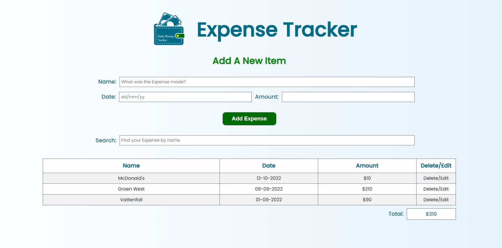

# Expense Tracker app

## 1. Description

This app help you tracking your expanses.
1- To how you are going to pay.</br>
2- When you have to pay.</br>
3- How much you have to pay.</br>
4- The total amount you have to pay.  

## 2. Link and Preview


Project link is available at [Expense Tracker App](https://f-naddaf.github.io/Side-Project)

## 3. App Folder Structure

```text
public
└── style.css
└── Images
  └── Expense-logo.png
src
└── pages
  └── recipe-page.js
  └── result-page.js
  └── search-page.js
└── views
  └── init-view.js
  └── recipe-view.js
  └── search-view.js
└── app.js
index.html
README.md
```

## The app must have

- [x] Nice logo.
- [ ] User can search for the payment entity.
- [ ] User can adding a new payment entity to his list.
- [ ] User can edit and delete a payment row from his list.
- [ ] User can check the total of all his expense.
- [ ] The background will change if the validity date of the payment = or > than 3 days.
- [ ] Making the app interact with a different devices.